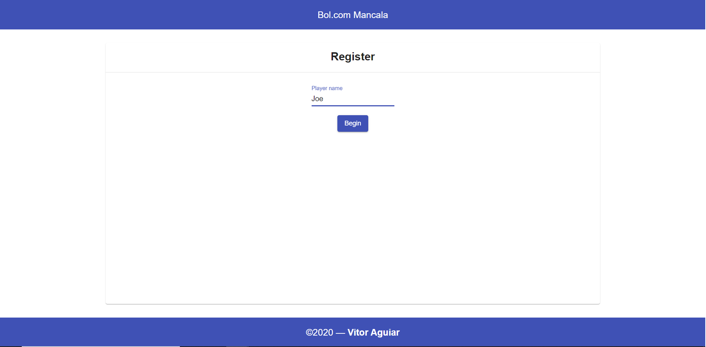
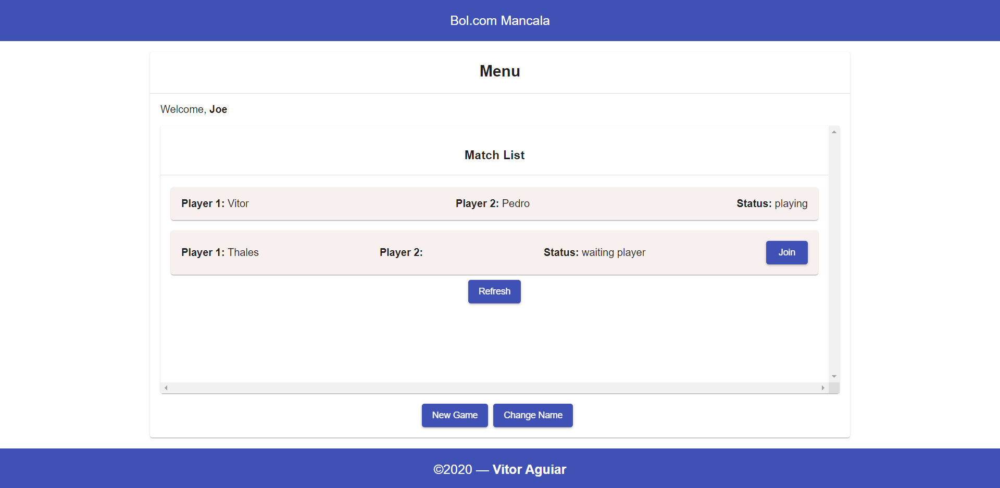
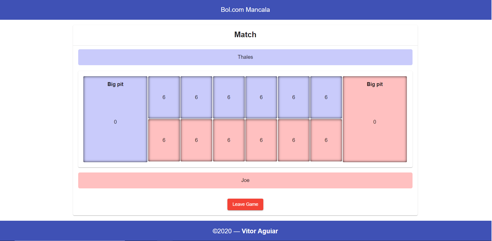

# Bol.com Mancala

---
### Requirements

- JDK 8
- Angular CLI

---

### Set up

**Backend:**

- Generate the JAR file through maven and run it (api folder). Can be also play in your IDE like Eclipse, VS Code.

**Frontend:**

- Run npm install inside the client folder
- Run 'ng s' inside the client folder

---
### Technologies

- **Server Side Language:** Java 8
- **Server framework:** Spring Boot, Spring Data, Spring Websocket, JUnit, Mockito
- **Database:** MongoDB
- **Client framework:** Angular 8

### Screenshots

---
**Register:**

---
**Lobby:**

---
**Match:**

